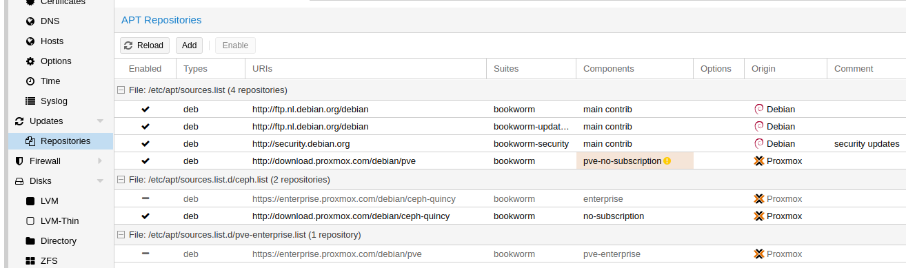

# pmx-cluster-tb
Proxmox cluster using 3 servers interconnected by USB4/Thunderbolt network.

This work is mainly based on prior work of [scyto](https://gist.github.com/scyto/) as described in his [Proxmox Proof of Concept](https://gist.github.com/scyto/76e94832927a89d977ea989da157e9dc).
# Problem Statement
A Proxmox cluster consists of two or more hosts, each running the Proxmox Virtual Environment (VE). Virtual Machines (VM's) and Linux Containers (LXC's) are hosted by the VE.
To enable High Availability (HA) of the VE's, you can build a Cluster of VE's, so that one VE can take over the VM's and LXC's from another VE in case of issues. These issues impacting the host may include software or hardware upgrades, hardware or software failures, etc. that prevents a host from working normally.
Proxmox has the feature to build the cluster with a (dedicated) network to carry the traffic caused by the transfer of a VM from one host to another. This transfer should happen quickly, while significant amount of data must be moved. Therefor a fast, reliable and preferably dedicated synchoronization network is prefererred.
Here we propose a cluster with a dedicated synchronization network based on USB4/Thunderbolt. USB4/Thunderbolt namely supports IP (by the thunderbolt-net Linux module), so Point-to-Point IP connections can be made.
The prior work by scyto demonstrates that this works on Intel based mini personal computers (Intel NUC13). Knowing that Thunderbolt support on Intel platforms is very good, the project described here takes on the challenge to test this on AMD based mini personal computers ([Bee-link GTR7](https://www.bee-link.com/catalog/product/index?id=485)).
# Architecture
The Proxmox cluster consists of 3 identical mini pc's, each with the following configuration:
- [Bee-link GTR 7](https://www.bee-link.com/catalog/product/index?id=485) (or [GTR 7 Pro](https://www.bee-link.com/catalog/product/index?id=545)) mini pc with AMD Ryzen 7 7840HS (or AMD Ryzen 9 7940HS) processor, 32 GB DDR5 5600 RAM, 2x 2.5 Gbps Ethernet ports, 2x USB4 ports
- [Samsung 990 Pro SSD](https://www.samsung.com/nl/memory-storage/nvme-ssd/990-pro-2tb-nvme-pcie-gen-4-mz-v9p2t0bw/) 2 TB drive for boot (200 GB) and data (1800 GB)
- [Samsung 990 Pro SSD](https://www.samsung.com/nl/memory-storage/nvme-ssd/990-pro-2tb-nvme-pcie-gen-4-mz-v9p2t0bw/) 2 TB drive for backup (200 GB) and data (1800 GB) (this is optional storage)
- [Thunderbolt4 cable](https://www.aliexpress.com/item/1005004619027797.html?spm=a2g0o.order_list.order_list_main.5.49c118022JCe4g), length: 50 cm

Each of these operate as an Proxmox VE. Each server has 2x USB4 ports. These ports are used to connect to the other 2 servers, so creating a 3-node ring configuration. The IP addresses for the new Point-to-Point network are not associated to individual interfaces, but are associated to `local host`. This way, it does not matter in which order/which of the two USB4 ports connect to a particular port on the other server. The Router (frr based) with the switch fabric engine will be able to route between the hosts using the Point-to-Point netwrok.

This project describes the changes that need to be made to the individual server configurations to enable an IP synchronization network.
# Bare Metal Proxmox Installation (repeat for all 3 hosts)
## Basic Proxmox Installation
Download the ISO for the Proxmox VE version 8.1 installation image (proxmox-ve_8.1-1.iso) onto a USB flash medium, such as the [Ventoy](https://www.ventoy.net/en/index.html) tool. Use version 1.0.96 in order to boot successfully. Or use [Balena Etcher](https://etcher.balena.io).
In the future, we want to use most of the storage space on the 2 TB Samsung SSD for cluster storage (Ceph). So when installing Proxmox on the server, select the (first) Samsung SSD but reduce the used space for Proxmox to 200 GB.
Then follow the PVE installation using default values. In my setup, I have connected one of the 2.5 Gbps ports to my home router (for internet access). The router normally manages the IP addressing by DHCP, but I have configured the router to keep the addresses between 192.168.178.1 and 192.168.178.20 outside the range used by DHCP, so I can assign a unique IP address from this range to each of the servers.
So in this particular network setup, these servers are configured as:
1. hostname: `pve1`, ip address: `192.168.178.11/24`, gateway: `192.168.178.1`, DNS: `192.168.178.1`, Disk Size: 200 GB
2. hostname: `pve2`, ip address: `192.168.178.12/24`, gateway: `192.168.178.1`, DNS: `192.168.178.1`, Disk Size: 200 GB
3. hostname: `pve3`, ip address: `192.168.178.13/24`, gateway: `192.168.178.1`, DNS: `192.168.178.1`, Disk Size: 200 GB

Install Proxmox VE version 8 following these steps:
1. Insert the Ventoy USB drive into one of the USB3.2 ports on the host
2. Boot the host and press F7 until the boot menu appears
3. Select your Ventoy USB drive as boot device
4. Select the Proxmox VE 8 Installer: "proxmox-ve_8.1-1.iso"
5. Select "Boot in normal mode"
6. Select "Install Proxmox VE (Graphical)"
7. Accept the EULA
8. Select the Target Harddisk: "/dev/nvme0n1 (Samsung SSD 990 PRO 2TB)" and click Options
9. Select: **Filesystem: ext4** and **hdsize: 200**. Leave swapsize, maxroot, minfree and maxvz empty.
10. Select Country, Time zone and Keyboard Layout
11. Enter the new root password and confirm. Enter your email address.
12. Select the management interface (e.g. enp3s0), enter the hostname (e.g. pve1.fritz.box), the fixed IP address (e.g. 192.168.178.11), the Gateway IP address and the DNS server IP address. The hostname and the fixed IP address must be different for each Proxmox host.
13. Review the entered values once again and click Install
14. Now the software will be installed on the system disk. After completion, the host will reboot. Remove the USB drive.
15. The GRUB boot menu is presented. Select "Proxmox VE GNU/Linux" to boot

## Additional steps after Proxmox installation
### Login
The Proxmox GUI can be accessed via the management interface using a browser. The URL is for:
1. `pve1`: [192.168.178.11:8006](http://192.168.178.11:8006)
2. `pve2`: [192.168.178.12:8006](http://192.168.178.12:8006)
3. `pve3`: [192.168.178.13:8006](http://192.168.178.13:8006)

You will be presented with a login widget:
.

Enter:
- User name: `root`
- Password: the password provided during Proxmox VE installation
- Realm: `Linux PAM standard authentication`
- Language: `English - English`

You will be prompted with a message about not having a valid subscription. Just click OK. Later we will disable this annoying message.
### Adapt Repositories
After the basic Proxmox installation, we need to adapt the repositories. Using the Proxmox GUI (user root), click Datacenter -> pveX -> Updates -> Repositories.
1. Select and `Disable` component `enterprise`
2. Select and `Disable` component `pve-enterprise`
3. Add `pve-no-subscription` by clicking `Add` and selecting `No Subscription`
4. Add `no-subscription` (ceph) by clicking `Add` and selecting `Ceph Reef No-Subscription`

The result will look like: 
### Check for updates and Upgrade
Now check for updates and upgrade the hosts to the latest software versions.

Using the Proxmox GUI (user root), click: Datacenter -> pveX -> Updates and then: `Refresh`, then `Upgrade`.

Check at Datacenter -> pveX -> Summary that the kernel version is `Linux 6.2.16-14-pve` or later.

To avoid the Subscription message ro pop-up every time you make a change to the host, we need to edit a file.
On the GUI select the host: Datacenter -> pveX and click the `>_Shell` button on the top of the screen. A new shell opens for the user with root permissions.

Type: `nano /usr/share/javascript/proxmox-widget-toolkit/proxmoxlib.js`

Press `^\` to find: `Ext.Msg.show` and replace by: `void({ //` and `Y`. Do this only for the first match. So now enter `^C` to cancel remaining replace operations.
Leave the editor by `^X` and `Y` to save the file and press `Enter` to leave.

## Add FRR Router and Iperf3 Test packages
Later, we want to interconnect the 3 hosts. In order for one host to find the other, the `frr` Router package is needed. Also, once the cluster is up and running, we want to be able to test the performance of each link. For that purpose, we need `iperf3`.
- as root, run: `apt install frr iperf3`

## Add secundary user (optional)
Normally, Proxmox VE only creates the user "root" with super user permissions. Here we add a secundary user with standard permission but with "sudo" capability to execute admin tasks hat require super user permissions.
- as root, run: `apt install sudo`
- as root, run: `adduser <username>`
-   provide password and other facts (optional)
- as root, run: `usermod -aG sudo <username>`

Note: After you have added a user, you can add this user to the Proxmox PAM user list by: Datacenter -> Permissions -> Users -> Add. The username must be the same as the Linux account you just created.
## Add Graphical User Interface to each server (optional)
Normally, Proxmox VE is installed as a headless server, i.e. is managed remotely using a web browser (port 8006). Just for convenience, we will enable the Linux GUI and install Chromium so we can manage each server locally.
- as root (or use sudo), run: `apt install mate chromium lightdm`
- as root (or use sudo), run: `systemctl start lightdm`
## Add Graphics Drivers incl. Vulkan (optional)
### Note: the build fails with error logged in: `/var/lib/dkms/amdgpu/6.2.4-1683306.22.04/build/make.log`
In case we want to use this host also for some playing of games (e.g. X-Plane 12), we need to install additional drivers for the iGPU.
- Download the `amdgpu-install` tool from AMD's support site: go to [AMD drivers for Linux](https://www.amd.com/en/support/linux-drivers) and open the `Ubuntu x86 64-Bit` accordion. In `adeon™ Software for Linux® version 23.30 for Ubuntu 22.04.3` click `Download` to download the latest .deb file into your Downloads folder.
- Open a terminal and run: `sudo apt install ~/Downloads/amdgpu-install*all.deb`
- Now run the installer: `sudo amdgpu-install --vulkan=amdvlk --opencl=rocr --usecase=graphics`
- Add the user to the render and video groups: `sudo usermod -aG render $USER && sudo usermod -aG video $USER`
- Install vulkan drivers and tools: `sudo apt install mesa-vulkan-drivers vulkan-tools`
- `sudo apt install grub-efi-amd64`
- Before you can use Vulkan, you need to set the following environment variable: `export VK_ICD_FILENAMES=/usr/share/vulkan/icd.d./radeon_icd.x86_64.json`, suggest to include this line in your .profile file.
- To check if Vulkan was corectly installed, run: `vulkaninfo --summary`

### Reboot
Now it is the right time to reboot the host, so we can enjoy the latest kernel. On Datacenter -> pveX, click the `Reboot` button.

# Enable Thunderbolt (repeat for all 3 hosts)
## Install `lldpd`
To enable LLDP (IEEE 802.1ab) Link Layer Discovery Protocol, install the lldpd package.
- as root (or use sudo): `apt install lldpd`
## Install Thunderbolt Modules
To enable Thunderbolt and Thunderbolt Networking, add the `thunderbolt` and `thunderbolt-net` modules to the `/etc/modules` file.
The contents of this file should look like:
```
# /etc/modules: kernel modules to load at boot time.
#
# This file contains the names of kernel modules that should be loaded
# at boot time, one per line. Lines beginning with "#" are ignored.
# Parameters can be specified after the module name.

# add TB for networking as per: https://gist.github.com/scyto/67fdc9a517faefa68f730f82d7fa3570?permalink_comment_id=4700311
thunderbolt
thunderbolt-net
```
## Edit Interfaces file
When the Thunderbolt interface show up, they will be named `thunderbolt0` and `thunderbolt1` per default. We want to rename these interfaces, so they follow the standard ethernet interface naming rules, so they will show up in the Proxmox network interfaces list.
The file `/etc/network/interfaces` must be changed by:
1. Delete the thunderboltX entries (if they are present)
2. Add the en05 and en06 entries for both IPv4 and IPv6 (take note of the increased MTU size)

So that the file will look like: (replace X with 1, 2, 3 for pve1, pve2 and pve3 respectively)
```
auto lo
iface lo inet loopback

auto lo:4
iface lo:4 inet static
        address 10.0.0.8X/32
#Thunderbolt IPv4
        
auto lo:6
iface lo:6 inet static
        address fc00::8X/128
#Thunderbolt IPv6

iface enp3s0 inet manual
#local

iface enp4s0 inet manual
#guest

auto vmbr0
iface vmbr0 inet static
	address 192.168.178.1X/24
	gateway 192.168.178.1
	bridge-ports enp3s0
	bridge-stp off
	bridge-fd 0
#local

auto en05
iface en05 inet static
        mtu 4000

iface en05 inet6 static
        mtu 4000

auto en06
iface en06 inet static
        mtu 4000

iface en06 inet6 static
        mtu 4000
```
## Detect Thunderbolt Interface device identifiers
We need to uniquely identify each Thunderbolt network device, in order to manage it. See: 

To find out what the ID's are, we use the device monitoring tool.
1. as root (or use sudo) run: `udevadm monitor` and keep it running
2. plug in one end of the Thunderbolt cable in the USB4 port closest to the HDMI socket, the other end of the Thunderbolt cable to an USB4 port on another host, and check the output of the monitor. It should report something like:

```
KERNEL[416631.261658] change   /0-2 (thunderbolt)
KERNEL[416631.261982] add      /devices/pci0000:00/0000:00:08.3/0000:ca:00.5/domain0/0-0/0-2 (thunderbolt)
KERNEL[416631.262026] add      /devices/pci0000:00/0000:00:08.3/0000:ca:00.5/domain0/0-0/0-2/0-2.0 (thunderbolt)
KERNEL[416631.262226] add      /devices/pci0000:00/0000:00:08.3/0000:ca:00.5/domain0/0-0/0-2/0-2.0/net/thunderbolt0 (net)
KERNEL[416631.262260] add      /devices/pci0000:00/0000:00:08.3/0000:ca:00.5/domain0/0-0/0-2/0-2.0/net/thunderbolt0/queues/rx-0 (queues)
KERNEL[416631.262279] add      /devices/pci0000:00/0000:00:08.3/0000:ca:00.5/domain0/0-0/0-2/0-2.0/net/thunderbolt0/queues/tx-0 (queues)
KERNEL[416631.262475] bind     /devices/pci0000:00/0000:00:08.3/0000:ca:00.5/domain0/0-0/0-2/0-2.0 (thunderbolt)
```
We will use the `0000:ca:00.5` string as identifier for the inner-most USB4 port.
Repeat this for the other USB4 port:
1. as root (or use sudo) run: `udevadm monitor` and keep it running
2. plug in one end of the Thunderbolt cable in the USB4 port closest to the Audio socket, the other end of the Thunderbolt cable to an USB4 port on another host, and check the output of the monitor. It should report something like:

```
KERNEL[416922.266301] change   /1-2 (thunderbolt)
KERNEL[416922.266584] add      /devices/pci0000:00/0000:00:08.3/0000:ca:00.6/domain1/1-0/1-2 (thunderbolt)
KERNEL[416922.266626] add      /devices/pci0000:00/0000:00:08.3/0000:ca:00.6/domain1/1-0/1-2/1-2.0 (thunderbolt)
KERNEL[416922.266906] add      /devices/pci0000:00/0000:00:08.3/0000:ca:00.6/domain1/1-0/1-2/1-2.0/net/thunderbolt0 (net)
KERNEL[416922.266929] add      /devices/pci0000:00/0000:00:08.3/0000:ca:00.6/domain1/1-0/1-2/1-2.0/net/thunderbolt0/queues/rx-0 (queues)
KERNEL[416922.266943] add      /devices/pci0000:00/0000:00:08.3/0000:ca:00.6/domain1/1-0/1-2/1-2.0/net/thunderbolt0/queues/tx-0 (queues)
KERNEL[416922.267044] bind     /devices/pci0000:00/0000:00:08.3/0000:ca:00.6/domain1/1-0/1-2/1-2.0 (thunderbolt)
```
We will use the `0000:ca:00.6` string as identifier for the outer-most USB4 port.
## Create link files for the Thunderbolt interfaces
For the inner-most USB4 port, create the file `/etc/systemd/network/00-thunderbolt0.link` with the following contents:
```
[Match]
Path=pci-0000:ca:00.5
Driver=thunderbolt-net
[Link]
MACAddressPolicy=none
Name=en05
```
For the outer-most USB4 port, create the file `/etc/systemd/network/00-thunderbolt1.link` with the following contents:
```
[Match]
Path=pci-0000:ca:00.6
Driver=thunderbolt-net
[Link]
MACAddressPolicy=none
Name=en06
```
## Create startup scripts for the Thunderbolt interfaces
For the inner-most USB4 port, create the file `/usr/local/bin/pve-en05.sh` with the following contents:
```
#!/bin/bash

# this brings the renamed interface up and reprocesses any settings in /etc/network/interfaces 
# for the renamed interface
/usr/sbin/ifup en05
```
Make the file executable by running as root (or by sudo): `chmod +x /usr/local/bin/pve-en05.sh`

For the outer-most USB4 port, create the file `/usr/local/bin/pve-en06.sh` with the following contents:
```
#!/bin/bash

# this brings the renamed interface up and reprocesses any settings in /etc/network/interfaces 
# for the renamed interface
/usr/sbin/ifup en06
```
Make the file executable by running as root (or by sudo): `chmod +x /usr/local/bin/pve-en06.sh`

## Create rules file to trigger the startup scripts
Create the file `/etc/udev/rules.d/10-tb-en.rules` with the following contents:
```
ACTION=="move", SUBSYSTEM=="net", KERNEL=="en05", RUN+="/usr/local/bin/pve-en05.sh"
ACTION=="move", SUBSYSTEM=="net", KERNEL=="en06", RUN+="/usr/local/bin/pve-en06.sh"
```
## Enable IPv4 and IPv6 Forwarding
By default, IPv4 and IPv6 forwarding is disable. To enable, we need to edit the `/etc/sysctl.conf` file.
- as root (or by sudo), open the file `/etc/sysctl.conf` for editing
- search for `forwarding` and then remove the `#` in front of: `#net.ipv6.conf.all.forwarding=1`
- search for `ip_forward` and then remove the `#` in front of: `#net.ipv4.ip_forward=1`
- save the file and exit the editor.

## Configure FRR
Now it is time to configure the FRR Router. We already have installed the `frr` package in an earlier step.
1. as root (or by sudo), open the file `/etc/frr/daemons` for editing
2. search for `fabricd` and then change the value `no` into `yes`
3. save the file and exit the editor
4. as root (or by sudo) restart frr `systemctl restart frr`

Next, we will configure the router.
1. as root (or by sudo), open the router shell: `vtysh`
2. show the current cobnfiguration by: `show running-config`
3. enter the configuration mode by: `configure`
4. type the following, where X is replaced by 1, 2, 3 for host pve1, pve2 and pve3:
```
frr version 8.5.2
frr defaults traditional
hostname pveX
log syslog informational
service integrated-vtysh-config
ip forwarding
ipv6 forwarding
!
interface en05
 ip router openfabric 1
 ipv6 router openfabric 1
exit
!
interface en06
 ip router openfabric 1
 ipv6 router openfabric 1
exit
!
interface lo
 ip router openfabric 1
 ipv6 router openfabric 1
 openfabric passive
exit
!
router openfabric 1
 net 49.0000.0000.000X.00
exit
!
end
```
5. save the configuration: `write memory`
6. check the configuration again: `show running-config` and fix any errors.
7. exit and repeat for the other hosts.

## Reboot the host
After all these changes to the host configuration files, it is time to reboot the system.
- as root (or by sudo), run: `reboot now`
## Check connectivity
After all hosts are booted, and interconnected by the 3 Thunderbolt cables, we can check whether each host can see eachother.
1. as root (or by sudo) type: `vtysh -c "show openfabric topology"`
2. we should see that each host can see the two other hosts, both with IPv4 (using IPv4 addresses: `10.0.0.81/32`, `10.0.0.82/32`, and `10.0.0.83/32`), and IPv6 (using IPv6 addresses: `fc00::81/128`, `fc00::82/128` and `fc00::83/128`) .
3. as root (or by sudo) run the iperf3 server on each host by: `iperf3 -s`
4. now we can test the connectivity and bandwidth between each pair of hosts, for example from pve1 to pve2: on pve1, run `iperf -c 10.0.0.82` and check that the bandwith is at least 10 Gbps.
## From here onwards, execute the procedure only once.

# Create Cluster
Now all 3 hosts are up and running and the inter-connectivity between each host has been verified, we can join the three hosts together into one cluster. We will name the cluster `pvc1`.
- We will start the cluster creation with pve1 and then
- join pve2 to the cluster.
- Finally we will join pve3 to the cluster.

So follow these steps in sequence:
1. Use the Proxmox GUI to login as root to `pve1`.
2. Go to Datacenter -> Cluster -> Create Cluster. Cluster Name: `pvc1`, Cluster Network Link 0: `fc00::81`, Cluster Network Link 1: `192.168.178.11`. Click Create and wait until the cluster creation task has completed.
3. Go to Datacenter -> Cluster -> Join Information and click `Copy Information`.
4. Use the Proxmox GUI to login as root to `pve2`.
5. Go to Datacenter -> Cluster -> Join Cluster. Paste the buffer into the text window. Enter the root password of pve1. Select `fc00::82/128` for Cluster Network Link 0, and `192.168.178.12/24` for Cluster Network Link 1. Click Join `pvc1`.
6. Use the Proxmox GUI to login as root to `pve1`.
7. Go to Datacenter -> Cluster -> Join Information and click `Copy Information`.
8. Use the Proxmox GUI to login as root to `pve3`.
9. Go to Datacenter -> Cluster -> Join Cluster. Paste the buffer into the text window. Enter the root password of pve1. Select `fc00::83/128` for Cluster Network Link 0, and `192.168.178.13/24` for Cluster Network Link 1. Click Join `pvc1`.
10. Close the browsers that are connected to `pve2` and `pve3`.
11. On `pve1` go to Datacenter. You should see the name of the Datacenter: `pvc1` with 3 hosts: `pve1`, `pve2` and `pve3`. Now the corosync network is operational, you can manage all pve's of the cluster from any of the pve's.

# Enable CEPH (this section is Draft)
Now we have a Cluster with 3 hosts, we can enable CEPH to manage the shared storage.
## Install CEPH (repeat this section for each Host in the Cluster)
Using the Proxmox GUI from any host, go to: `Datacenter` -> `pveX` (X is 1, 2 or 3) -> `Ceph` and then click `Install Ceph`. Change the Repository from `Enterprise (Recommended)` into: `No Subscription` and select `reef (18.2)`. Then click `Start reef installation`. A CLI window is created. Follow the instructions provided. This will install Ceph. Click `Next`. On the Configuration page, provide the Public IP Network CIDR: `192.168.178.1X/24` (X is 1, 2 or 3). Provide the Cluster IP Network CIDR: `fc00::8X/128` (X is 1, 2 or 3). Click `Next` and `Finish`.

# Create CEPH OSD (this section is Draft)
Now CEPH is installed, we can add the actual storage. When we installed Proxmox on each host, we did not use all the space available on the SSD, but only reserved 200 GB for Proxmox. The remaining 1800 GB (aprox.), is still unallocated on the SSD. Although Proxmox does not recommend to use an OSDN on the same disk device as the host OS, we are going to do this. So, the first 200 GB of the SSD is provided for 3 partitions used by Proxmox; the remaining is used for partition 4 and provided to Ceph.
- Check the above is true. Open a terminal window for the host via the GUI: `Datacenter`-> `pveX` (X is 1, 2 or 3) and click `Shell`. Type: `lsblk`. You should see (for a 2TB SSD installed in slot0):
	- nvme0n1 1.8T disk total: 3907029168
	- nvme0n1p1 1007k part 34 - 2047 (2014)
	- nvme0n1p2 1G part /boot/... 2048 - 2099199 (2097152)
	- nvme0n1p3 199G part 2099200 - 419430400 (417331201)
	- followed by LVM information for the local storage already used.

Now create partition 4 on this disk:
- In the same terminal window, type: `fdisk /dev/nvme0n1`. Type `F` to see how many sectors are still free on your SSD. Here it shows: 419432448 - 3907029134 (3487596687) 1.6TB. Type `n` to create a new partition. Accept the default values: 4 (partition number), 419432448 (first sector), 3907028997 (last sector). Then type `w` to write back the partition table.
- In the same terminal window, type: `lsblk` to see that now you have an addition partition 4 (nvme0n1p4) with size 1.6TB.
- In the same terminal window, type: `mkfs -t xfs /dev/nvme0n1p4` to create an XFS file system on this partition. (Note: Ceph will erase this in a next step anyhow).
- Now we will wipe this partition. Use the Proxmox GUI: `Datacenter` -> `pveX` (X is 1, 2 or 3) -> `Disks` and locate your Device in the list as `/dev/nvme0n1p4` (you may need to change the width of the column to see all). When you click on this item, a button appears `wipe disk`. After you have made sure you selected the correct partition, click this button and wait for the process to finish.
- Now you have an empty partition, you can tell Ceph to use it as an OSD. Use the Proxmox GUI: `Datacenter` -> `pveX` (X is 1, 2 or 3) -> `Ceph` -> `OSD`. Click the button `Create OSD`. Select the empty partition `/dev/nvme0n1p4` as your disk, select `Use OSD Disk` as DB Disk. Click the `Advanced` check box and select `nvme` as device class. Then click `Create`.
